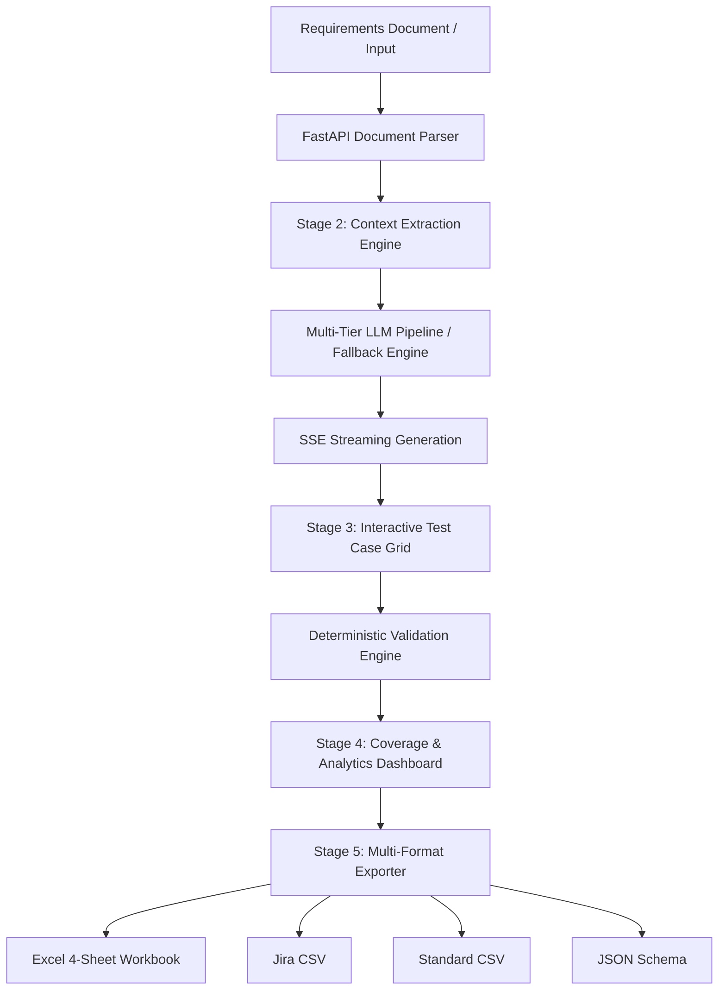

# UATlens AI — AI-Powered UAT Test Case Generator & Validation Platform

> **"AI drafts, the system validates, the human approves."**

[](https://nextjs.org/)
[](https://fastapi.tiangolo.com/)
[](https://www.typescriptlang.org/)
[](https://python.org/)
[](https://tailwindcss.com/)
[](https://opensource.org/licenses/MIT)

UATlens AI transforms complex requirement documents (PRDs, BRDs, User Stories, Acceptance Criteria) into complete, verified, and traceable User Acceptance Testing (UAT) test cases in minutes. Every test case links directly to a verbatim source quote with a zero-hallucination guarantee.

---

## 🌟 Key Features

- **5-Stage Intelligent Pipeline**:
  1. **Stage 1 (Input)**: Upload PRDs/BRDs (.pdf, .docx, .txt, .md) or paste text directly. Includes pre-loaded e-commerce checkout preset.
  2. **Stage 2 (Context Review)**: 7-tab extracted context review (Business Rules, Roles, Preconditions, Integrations, Constraints, Happy Paths, Edge Cases) with inline editing.
  3. **Stage 3 (Test Case Grid)**: Interactive TanStack data grid with inline editing, scenario filtering, source quote traceability drawer, single-test regeneration, and undo/version rollback.
  4. **Stage 4 (Analytics Dashboard)**: Recharts-powered analytics for scenario distribution, priority breakdown, requirement coverage matrix, and automated quality scoring.
  5. **Stage 5 (Multi-Format Export)**: Export to professional 4-sheet formatted Excel workbook (.xlsx), Standard CSV, Jira-compatible CSV, and JSON schemas.

- **Zero-Hallucination & Full Traceability**:
  - Deterministic validation engine checks for vague terminology (*"quickly"*, *"user-friendly"*).
  - Verbatim source quote verification against original document content.
  - Requirement coverage gap analysis ensuring 100% of functional requirements have test cases.
  - Jaccard similarity duplicate detection to prevent redundant testing.

- **Resilient AI Generation**:
  - Multi-tier LLM architecture: Google Gemini + Anthropic Claude + deterministic offline fallback engine.
  - Real-time Server-Sent Events (SSE) streaming with live progress bars and step counters.

- **Stunning Glassmorphism Design**:
  - Modern light-theme design system featuring frosted glass cards, dynamic floating gradient orbs, micro-animations, and responsive layout.

---

## 🏗️ System Architecture



---

## 🚀 Quick Start Guide

### Prerequisites
- **Node.js** >= 18.x
- **Python** >= 3.11
- **Git**

### 1. Clone the Repository
```bash
git clone https://github.com/Akil-Ai/UATLens-AI.git
cd UATLens-AI
```

### 2. Backend Setup
```bash
cd backend
python -m venv .venv
source .venv/bin/activate  # On Windows: .venv\Scripts\activate
pip install -r requirements.txt

# Start backend server (runs on http://127.0.0.1:8000)
uvicorn backend.app.main:app --host 127.0.0.1 --port 8000 --reload
```

### 3. Frontend Setup
```bash
cd ../frontend
npm install

# Start Next.js development server (runs on http://localhost:3000)
npm run dev
```

### 4. Open Application
Navigate to [http://localhost:3000](http://localhost:3000) in your browser.

---

## 👥 Core Development Team

| Contributor | Role | GitHub | Email |
|:---|:---|:---|:---|
| **Akil** | Full Stack & AI Architect | [@Akil-Ai](https://github.com/Akil-Ai) | akilrmhss@gmail.com |
| **Gokhul** | Backend & Validation Lead | [@goku-777](https://github.com/goku-777) | gokhulgokhul161@gmail.com |
| **Deepak Doss** | Frontend & Glassmorphism UI | [@DeepakDoss](https://github.com/DeepakDoss) | dossd7438@gmail.com |
| **Deepan** | Data Parsing & Export Engine | [@Deepan-211](https://github.com/Deepan-211) | deepanthangavel211@gmail.com |

---

## 📄 License
This project is licensed under the MIT License - see the [LICENSE](LICENSE) file for details.